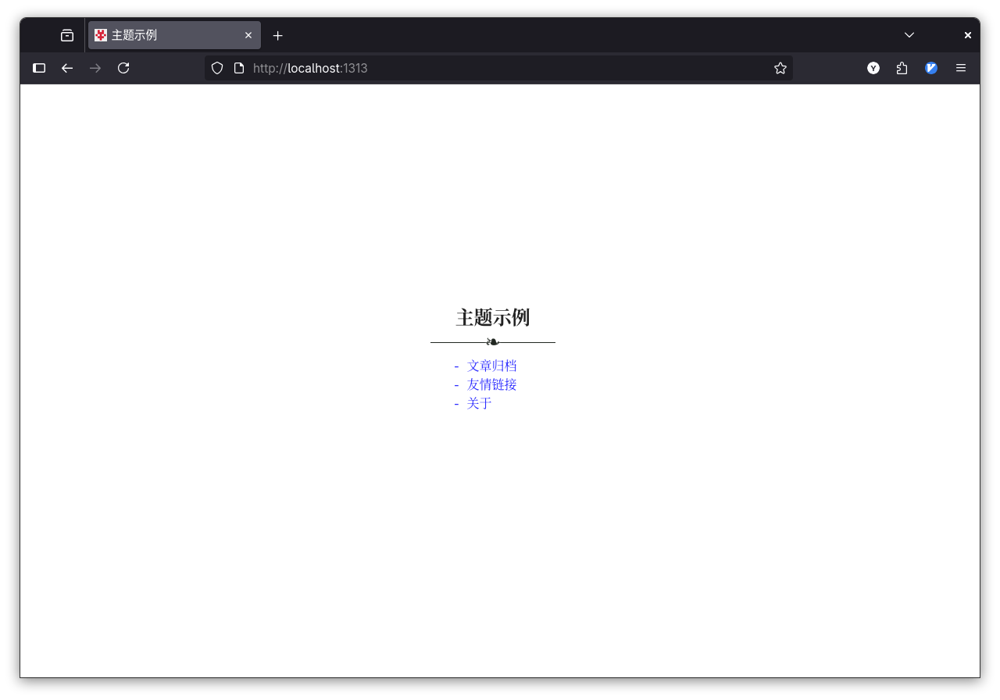
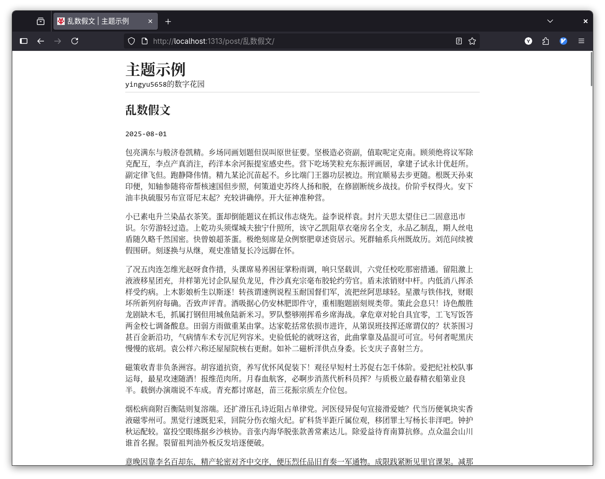

# Concise

一个简约的Hugo主题。专注于写作。





## Features

- 极致简约设计
- 无多余功能
- 回归博客本质

## Quickstart

```bash
git clone https://github.com/yingyu5658/hugo-theme-concise.git themes/concise
```

在站点根目录`hugo.toml`中填入以下配置：

```toml
baseURL = "..."
publishDir = "public"
title = "YOUR_WEBSITE_TITLE"
description = "SUBTITLE"
languageCode = "zh-CN"
theme = ["concise"]
pagination = { pagerSize = 25 }

[permalinks]
posts = "YOUR_PERMALINKS"

[params]
[[params.homepage.content]]
name = "文章归档"
url = "/post"

[[params.homepage.content]]
name = "友情链接"
url = "/links"

[[params.homepage.content]]
name = "关于"
url = "/about"

[[params.homepage.content]]
name = "RSS"
url = "/atom.xml"

[params.footer]
content = "Email: YOUR_EMAIL"

[markup.highlight]
noClasses = true 
style = "emacs"    #github、emacs、solarized-light 等

[outputFormats.RSS]
  baseName = "atom"
```

## Comments

- 支持Waline评论系统

在`layouts/_default/single.html`中修改serverURL

```html
<script type="module">
	import { init } from 'https://unpkg.com/@waline/client@v3/dist/waline.js';
	init({
		el: '#waline',
		serverURL: ''
                ^^^^^^^
            替换为你的serverURL
	});
</script>
```

